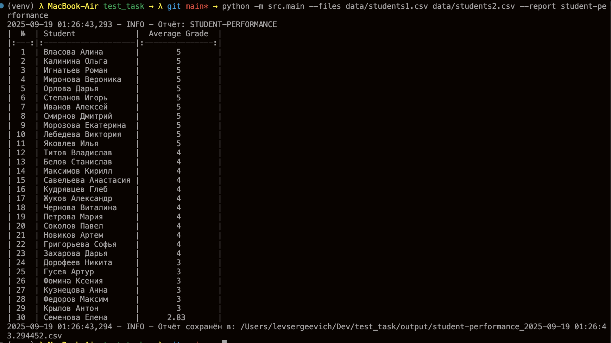

# СРЕДНЯЯ ОЦЕНКА СТУДЕНТОВ

Проект для обработки CSV-файлов с данными об успеваемости студентов. Формирует отчёты по средним оценкам студентов и сохраняет их в CSVфайлы. Проект завёрнут в Docker для удобного запуска.

## Описание

Скрипт обрабатывает CSV-файлы с данными об успеваемости студентов, вычисляет средние оценки и генерирует отчёт в формате таблицы, выводимой в консоль и сохраняемой в CSV. Основные возможности:
- Поддержка нескольких CSV-файлов через аргумент `--files`.
- Генерация отчёта `student-performance` через аргумент `--report`.
- Логирование в консоль и файлы (`logs/`).
- Сохранение отчётов в `output/`.
- Запуск через Docker с предустановленными аргументами.

## Стек

- **Python3.11**
- **Docker**
- **PyTest**
- **Tabulate**

## Запуск

1. Клонирование репозитория:

   ```bash
   git clone git@github.com:LevKorobeinikov/test_task.git
   cd test_task
   ```

2. Создать и активировать виртуальное окружение:

   Для Windows:

   ```bash
   python -m venv venv
   source venv/Scripts/activate
   ```

   Для Linux/macOS:

   ```bash
   python3 -m venv venv
   source venv/bin/activate
   ```

3. Установка зависимостей:
   ```bach
   pip install -r requirements.txt
   ```

4. Запуск скрипта:
   ```bach
   python -m src.main --files data/students1.csv data/students2.csv --report student-performance
   ```

5. Альтернативный запуск, через Docker:
   ```bach
   docker build -t my-app .
   docker run my-app
   ```

## Резултат:

 
## Добавить новый локальный отчёт

1.	Создаёшь src/reports/teacher_performance.py.
2.	В нём ставишь 
   ```bach
   @register_report('teacher-performance') # и класс, реализующий generate.
   ``` 
3. load_reports() при следующем запуске импортирует модуль и зарегистрирует отчёт.
4. python -m src.main --files data.csv --report my-report 